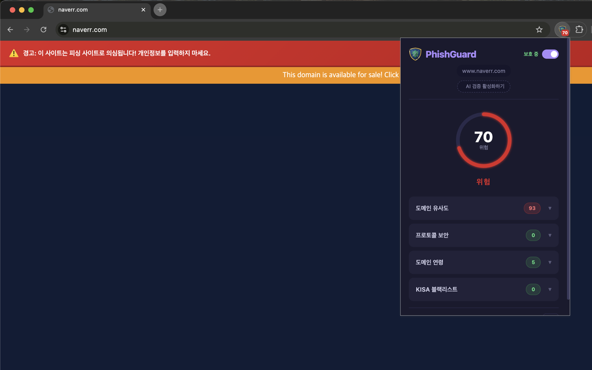
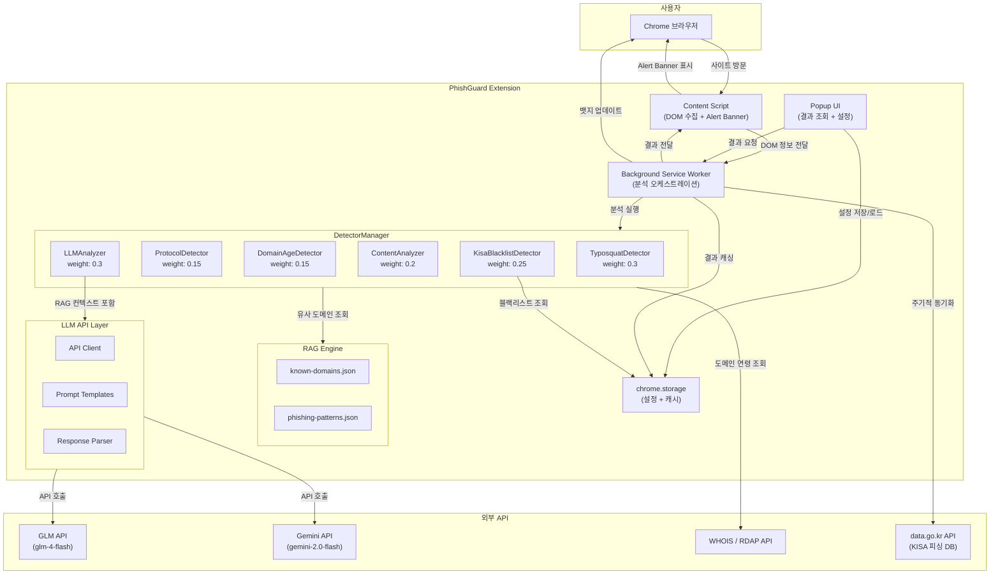

<p align="center">
  
</p>

<h1 align="center">PhishGuard</h1>

<p align="center">
  <strong>"당신의 브라우저를 지키는 AI 경비원"</strong>
</p>

<p align="center">
  
  
  
  
  
  
  
</p>

<p align="center">
  
</p>

---

## 1. PhishGuard 소개

PhishGuard는 **LLM API + Prompt Engineering + RAG** 기술을 결합하여 피싱 및 스캠 웹사이트를 실시간으로 감지하는 Chrome 확장 프로그램(Manifest V3)입니다. 경진대회 제출용 MVP로 개발되었습니다.

### 주요 기능

| 기능                        | 설명                                                                                                                                     |
| --------------------------- | ---------------------------------------------------------------------------------------------------------------------------------------- |
| **실시간 피싱 감지**        | 사용자가 방문하는 웹사이트를 자동으로 분석하여 위험도를 평가합니다.                                                                      |
| **타이포스쿼팅 탐지**       | Levenshtein Distance, Jaro-Winkler 유사도, 동형문자(Homoglyph) 감지를 통해 유명 도메인을 위장한 피싱 도메인을 식별합니다.                |
| **프로토콜 보안 검사**      | HTTP/HTTPS 프로토콜 상태, Mixed Content, 민감 정보 입력 폼의 암호화 여부를 확인합니다.                                                   |
| **도메인 연령 분석**        | WHOIS/RDAP API를 활용하여 최근 등록된 신생 도메인을 탐지합니다.                                                                          |
| **콘텐츠 분석**             | 긴급성/공포 유도 문구, 보상/당첨 사기 문구, 브랜드 위장, 의심스러운 입력 폼 등을 감지합니다.                                             |
| **정부기관 사칭 탐지**      | 법원, 검찰, 경찰 등 정부기관을 사칭하는 도메인 및 콘텐츠를 감지합니다. 한글 도메인(IDN) 피싱과 보이스피싱 연계 랜딩 페이지를 탐지합니다. |
| **KISA 피싱 블랙리스트**    | 한국인터넷진흥원(KISA)의 피싱사이트 URL 데이터(27,582건)를 공공데이터포털 API로 동기화하여 알려진 피싱 사이트를 즉시 탐지합니다.         |
| **LLM 종합 판단**           | GLM/Gemini API를 활용하여 여러 감지 모듈의 결과를 종합적으로 분석합니다.                                                                 |
| **RAG 기반 피싱 패턴 매칭** | 로컬 JSON DB에서 알려진 피싱 패턴 및 정규 도메인 정보를 검색하여 LLM 프롬프트에 컨텍스트로 제공합니다.                                   |

---

## 2. 아키텍처



### 분석 흐름 요약

1. 사용자가 웹사이트에 방문하면 **Content Script**가 DOM 정보(제목, 폼, 텍스트, 외부 리소스 등)를 수집합니다.
2. 수집된 정보는 **Background Service Worker**로 전달되며, 화이트리스트 및 캐시를 확인합니다.
3. **DetectorManager**가 등록된 감지 모듈(Typosquat, Protocol, DomainAge, Content, KISA Blacklist)을 **병렬**로 실행합니다.
4. 1차 종합 점수가 30~80점 사이인 경우, **LLMAnalyzer**가 RAG Engine의 컨텍스트와 함께 LLM API를 호출합니다.
5. 각 모듈의 결과를 **가중 평균**으로 종합하여 최종 위험도(0~100)와 위험 등급(safe/warning/danger)을 산출합니다.
6. 결과는 Content Script로 전달되어 **Shadow DOM 기반 Alert Banner**로 사용자에게 경고합니다.
7. **Popup UI**에서 상세 분석 결과를 확인할 수 있습니다.

---

## 3. 설치 및 실행 방법

### 사전 요구 사항

- Google Chrome 브라우저 (버전 88 이상, Manifest V3 지원)

### 설치 절차

1. 이 저장소를 클론하거나 ZIP으로 다운로드합니다.

   ```bash
   git clone https://github.com/your-username/phishguard.git
   ```

2. Chrome 브라우저에서 주소창에 아래 주소를 입력합니다.

   ```
   chrome://extensions
   ```

3. 우측 상단의 **개발자 모드** 토글을 활성화합니다.

4. **"압축해제된 확장 프로그램을 로드합니다"** 버튼을 클릭합니다.

5. 다운로드한 `phishguard` 폴더를 선택합니다.

6. 확장 프로그램 목록에 **"PhishGuard - AI 피싱 감지"**가 표시되면 설치가 완료된 것입니다.

7. 툴바에 PhishGuard 아이콘을 고정하면 위험도 뱃지를 상시 확인할 수 있습니다.

---

## 4. 감지 모듈

| 모듈명                    | 파일                            | 가중치 | 역할                                                                                                                     |
| ------------------------- | ------------------------------- | ------ | ------------------------------------------------------------------------------------------------------------------------ |
| **TyposquatDetector**     | `detectors/domain-typosquat.js` | 0.30   | 유명 도메인과의 문자열 유사도 분석, 동형문자(Homoglyph) 감지, 서브도메인 위장 탐지, 하이픈 삽입 감지, TLD 변경 감지      |
| **ProtocolDetector**      | `detectors/protocol-check.js`   | 0.15   | HTTP/HTTPS 프로토콜 확인, Mixed Content 감지, HTTP 환경의 민감 정보 입력 폼 경고                                         |
| **DomainAgeDetector**     | `detectors/domain-age.js`       | 0.15   | WHOIS/RDAP API를 통한 도메인 등록일 조회, 신생 도메인(30일 미만) 고위험 판정                                             |
| **ContentAnalyzer**       | `detectors/content-analysis.js` | 0.20   | 긴급성/공포 유도 문구, 보상/당첨 유도 문구, 의심스러운 입력 폼, 브랜드/정부기관 위장(타이틀/파비콘), 외부 로고 도용 감지 |
| **KisaBlacklistDetector** | `detectors/kisa-blacklist.js`   | 0.25   | KISA 피싱사이트 URL DB(27,582건)와 방문 URL을 O(1) 매칭하여 알려진 피싱 사이트 즉시 탐지 (매칭 시 risk: 100)             |
| **LLMAnalyzer**           | `detectors/llm-analysis.js`     | 0.30   | 다른 모듈의 분석 결과 + RAG 컨텍스트를 종합하여 LLM에 최종 판단 요청 (1차 점수 30~80 구간에서만 호출)                    |

### 위험도 판정 기준

| 등급        | 점수 범위 | 설명                               |
| ----------- | --------- | ---------------------------------- |
| **safe**    | 0 ~ 39    | 안전한 사이트                      |
| **warning** | 40 ~ 69   | 주의가 필요한 사이트               |
| **danger**  | 70 ~ 100  | 피싱/스캠이 강하게 의심되는 사이트 |

---

## 5. LLM API 설정 방법

PhishGuard는 **GLM (glm-4-flash)** 과 **Google Gemini (gemini-2.0-flash)** 두 가지 LLM 프로바이더를 지원합니다.

### 설정 절차

1. 툴바에서 PhishGuard 아이콘을 클릭하여 팝업을 엽니다.
2. 팝업 하단의 **설정** 버튼을 클릭합니다.
3. **LLM 프로바이더**를 선택합니다.
   - **GLM**: [open.bigmodel.cn](https://open.bigmodel.cn)에서 API 키를 발급받습니다.
   - **Gemini**: [Google AI Studio](https://aistudio.google.com)에서 API 키를 발급받습니다.
4. 발급받은 **API 키**를 입력합니다.
5. **저장** 버튼을 클릭합니다.

> **참고**: LLM 분석은 API 키가 설정된 경우에만 활성화되며, 1차 분석 결과가 30~80점 사이인 모호한 케이스에서만 호출됩니다. API 호출 비용을 최소화하기 위해 분당 최대 5회로 제한됩니다.

---

## 6. KISA 블랙리스트 설정 방법

PhishGuard는 **한국인터넷진흥원(KISA)**에서 제공하는 피싱사이트 URL 데이터(27,582건)를 [공공데이터포털(data.go.kr)](https://www.data.go.kr/data/15109780/openapi.do) Open API를 통해 동기화합니다.

### API 키 발급

1. [공공데이터포털](https://www.data.go.kr)에 회원가입 및 로그인합니다.
2. [KISA 피싱사이트 URL 데이터](https://www.data.go.kr/data/15109780/openapi.do) 페이지에서 **활용신청**을 합니다.
3. 승인 후 **마이페이지 > 오픈API > 인증키**에서 **일반 인증키(Encoding)**를 복사합니다.

### 확장 프로그램 설정

1. 툴바에서 PhishGuard 아이콘을 클릭하여 팝업을 엽니다.
2. 팝업 하단의 **설정** 버튼을 클릭합니다.
3. **KISA 블랙리스트** 토글을 활성화합니다.
4. **공공데이터포털 API 키** 입력란에 발급받은 인증키를 입력합니다.
5. **KISA 키 저장** 버튼을 클릭합니다.
6. 자동으로 전체 동기화가 시작되며, 완료까지 약 1~2분이 소요됩니다.

### 동기화 방식

| 유형            | 주기       | 설명                                                            |
| --------------- | ---------- | --------------------------------------------------------------- |
| **전체 동기화** | 최초 1회   | API 키 저장 시 전체 27,582건을 1,000건 단위로 순차 다운로드     |
| **증분 동기화** | 24시간마다 | `chrome.alarms`로 최근 데이터 5페이지를 가져와 기존 목록에 병합 |

> **참고**: 블랙리스트 데이터(~1MB)는 `chrome.storage.local`에 저장되며, 서비스워커가 종료되더라도 동기화 상태가 보존됩니다. 블랙리스트에 매칭되면 해당 사이트는 **즉시 위험(risk: 100)**으로 판정됩니다.

---

## 7. 기술 스택

| 카테고리           | 기술                                                                  |
| ------------------ | --------------------------------------------------------------------- |
| **플랫폼**         | Chrome Extension Manifest V3                                          |
| **언어**           | Vanilla JavaScript (ES Modules)                                       |
| **UI 격리**        | Shadow DOM (Alert Banner)                                             |
| **LLM API**        | GLM API (glm-4.7-flash) / Gemini API (gemini-2.5-flash-lite)          |
| **RAG**            | Local JSON DB (`known-domains.json`, `phishing-patterns.json`)        |
| **문자열 유사도**  | Levenshtein Distance, Jaro-Winkler Similarity                         |
| **피싱 기법 탐지** | Homoglyph Detection, Subdomain Impersonation, Typosquatting           |
| **도메인 정보**    | WHOIS API (ip2whois), RDAP API                                        |
| **피싱 DB**        | KISA 피싱사이트 URL DB (공공데이터포털 Open API, 27,582건)            |
| **상태 관리**      | `chrome.storage.sync` (설정), `chrome.storage.session` (분석 결과)    |
| **캐싱**           | In-Memory Cache + chrome.storage.local (도메인 연령, KISA 블랙리스트) |
| **주기적 작업**    | `chrome.alarms` API (24시간 주기 블랙리스트 동기화)                   |

---

## 8. 프로젝트 구조

```
phishguard/
├── manifest.json                  # Chrome Extension 매니페스트 (MV3)
│
├── assets/
│   ├── icon-16.png                # 익스텐션 아이콘 (16x16)
│   ├── icon-48.png                # 익스텐션 아이콘 (48x48)
│   └── icon-128.png               # 익스텐션 아이콘 (128x128)
│
├── background/
│   ├── service-worker.js          # 백그라운드 서비스 워커 (분석 오케스트레이션)
│   └── kisa-sync.js               # KISA 블랙리스트 동기화 엔진
│
├── content/
│   └── content-script.js          # 콘텐츠 스크립트 (DOM 수집 + Alert Banner)
│
├── detectors/
│   ├── index.js                   # DetectorManager (모듈 통합 매니저)
│   ├── domain-typosquat.js        # 타이포스쿼팅 감지 모듈
│   ├── protocol-check.js          # 프로토콜 보안 검사 모듈
│   ├── domain-age.js              # 도메인 연령 분석 모듈
│   ├── content-analysis.js        # 콘텐츠 분석 모듈
│   ├── kisa-blacklist.js          # KISA 블랙리스트 감지 모듈
│   └── llm-analysis.js            # LLM 종합 분석 모듈
│
├── llm/
│   ├── api-client.js              # LLM API 호출 클라이언트 (GLM / Gemini)
│   ├── prompts.js                 # 프롬프트 템플릿
│   └── response-parser.js         # LLM 응답 파서
│
├── rag/
│   ├── rag-engine.js              # RAG 엔진 (유사 도메인 검색 + 패턴 매칭)
│   ├── known-domains.json         # 알려진 정규 도메인 DB
│   └── phishing-patterns.json     # 피싱 패턴 DB (URL 패턴 + 키워드)
│
├── popup/
│   ├── popup.html                 # 팝업 UI HTML
│   ├── popup.css                  # 팝업 UI 스타일
│   └── popup.js                   # 팝업 UI 스크립트
│
├── ui/
│   ├── alert-banner.js            # 경고 배너 컴포넌트
│   ├── alert-banner.css           # 경고 배너 스타일
│   ├── detail-panel.js            # 상세 분석 패널
│   └── risk-badge.js              # 익스텐션 뱃지 관리
│
├── config/
│   └── settings.js                # 설정 관리 (chrome.storage.sync)
│
└── utils/
    ├── logger.js                  # 로깅 유틸리티
    ├── string-similarity.js       # 문자열 유사도 알고리즘 (Levenshtein, Jaro-Winkler, Homoglyph)
    └── url-parser.js              # URL 파싱 유틸리티
```

---

## 9. 향후 개선 계획

- **실시간 피싱 DB 업데이트**: 외부 피싱 DB(PhishTank, OpenPhish 등)와 연동하여 최신 피싱 도메인 정보를 자동으로 업데이트
- **사용자 신고 기반 커뮤니티 DB**: 사용자가 직접 피싱 사이트를 신고하고 공유하는 커뮤니티 기반 데이터베이스 구축
- **머신러닝 기반 피싱 분류 모델**: TensorFlow.js를 활용한 온디바이스 피싱 분류 모델 탑재
- **보이스피싱 연계 탐지 고도화**: 한글 도메인(IDN/Punycode) 분석 강화 및 정부기관 사칭 패턴 실시간 업데이트
- **다국어 지원 확대**: 한국어/영어 외 일본어, 중국어 등 다국어 피싱 패턴 지원
- **Chrome 웹스토어 배포**: 공식 Chrome 웹스토어에 등록하여 일반 사용자 대상 배포

---

## 10. 라이선스

이 프로젝트는 [MIT License](https://opensource.org/licenses/MIT)에 따라 라이선스가 부여됩니다.

```
MIT License

Copyright (c) 2025 PhishGuard

Permission is hereby granted, free of charge, to any person obtaining a copy
of this software and associated documentation files (the "Software"), to deal
in the Software without restriction, including without limitation the rights
to use, copy, modify, merge, publish, distribute, sublicense, and/or sell
copies of the Software, and to permit persons to whom the Software is
furnished to do so, subject to the following conditions:

The above copyright notice and this permission notice shall be included in all
copies or substantial portions of the Software.

THE SOFTWARE IS PROVIDED "AS IS", WITHOUT WARRANTY OF ANY KIND, EXPRESS OR
IMPLIED, INCLUDING BUT NOT LIMITED TO THE WARRANTIES OF MERCHANTABILITY,
FITNESS FOR A PARTICULAR PURPOSE AND NONINFRINGEMENT. IN NO EVENT SHALL THE
AUTHORS OR COPYRIGHT HOLDERS BE LIABLE FOR ANY CLAIM, DAMAGES OR OTHER
LIABILITY, WHETHER IN AN ACTION OF CONTRACT, TORT OR OTHERWISE, ARISING FROM,
OUT OF OR IN CONNECTION WITH THE SOFTWARE OR THE USE OR OTHER DEALINGS IN THE
SOFTWARE.
```
